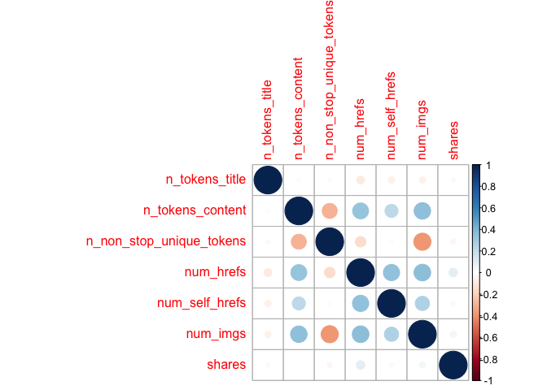

ST558Project2
================
Yuyao Liu
10/14/2020

# Introduction

I will analyze the Online News Popularity Data. This dataset summarizes
a heterogeneous set of features about articles published by Mashable in
a period of two years. There are 61 variables in the dataset which
contains 58 predictive attributes, 2 non-predictive attributes and one
target variable ‘share’. I choose some of the predictive variables that
can contains most of the information. For example, I choose some
variables of average values instead of minimum or maximum, so it may get
rid of some outliers. Also, some variables are about sentiment polarity
or subjectivity, I choose one variable of these two types that can
represent most information about word tokens. Meanwhile, I deleted some
variables that are highly correlated with some others.

## Predictors:

1.  n\_tokens\_title: Number of words in the title

2.  n\_tokens\_content: Number of words in the content

3.  n\_non\_stop\_unique\_tokens: Rate of unique non-stop words in the
    content

4.  num\_hrefs: Number of links

5.  num\_self\_hrefs: Number of links to other articles published by
    Mashable

6.  num\_imgs: Number of images

7.  num\_videos: Number of videos

8.  average\_token\_length: Average length of the words in the content

9.  num\_keywords: Number of keywords in the metadata

10. data\_channel\_is\_lifestyle: Is data channel ‘Lifestyle’?

11. data\_channel\_is\_entertainment: Is data channel ‘Entertainment’?

12. data\_channel\_is\_bus: Is data channel ‘Business’?

13. data\_channel\_is\_socmed: Is data channel ‘Social Media’?

14. data\_channel\_is\_tech: Is data channel ‘Tech’?

15. data\_channel\_is\_world: Is data channel ‘World’?

16. kw\_avg\_min: Worst keyword (avg. shares)

17. kw\_avg\_max: Best keyword (avg. shares)

18. kw\_avg\_avg: Avg. keyword (avg. shares)

19. self\_reference\_avg\_sharess: Avg. shares of referenced articles in
    Mashable

20. LDA\_00: Closeness to LDA topic 0

21. LDA\_01: Closeness to LDA topic 1

22. LDA\_02: Closeness to LDA topic 2

23. LDA\_03: Closeness to LDA topic 3

24. LDA\_04: Closeness to LDA topic 4

25. global\_rate\_positive\_words: Rate of positive words in the content

26. global\_rate\_negative\_words: Rate of negative words in the content

27. avg\_positive\_polarity: Avg. polarity of positive words

28. avg\_negative\_polarity: Avg. polarity of negative words

29. title\_subjectivity: Title subjectivity

30. title\_sentiment\_polarity: Title polarity

## Response/Target

shares: Number of shares

## Goal

The goal is to predict the number of shares(`shares`) in social
networks. I will use regression tree and boosted tree to predict shares,
and compare them using test set.

``` r
library(rmarkdown)
library(tidyverse)
library(caret)
library(corrplot)
```

# Data

``` r
path <- file.path(getwd(), "OnlineNewsPopularity.csv")
temp_news <- read_csv(file = path)
weekday <- vector()
for(i in seq_len(nrow(temp_news))){
  if (temp_news$weekday_is_monday[i] == 1){
    weekday[i]  <- "monday"
  }
  else if (temp_news$weekday_is_tuesday[i] == 1){
    weekday[i]  <- "tuesday"
  }
  else if (temp_news$weekday_is_wednesday[i] == 1){
    weekday[i]  <- "wednesday"
  }
  else if (temp_news$weekday_is_thursday[i] == 1){
    weekday[i]  <- "thursday"
  }
  else if (temp_news$weekday_is_friday[i] == 1){
    weekday[i]  <- "friday"
  }
  else if (temp_news$weekday_is_saturday[i] == 1){
    weekday[i]  <- "saturday"
  }
  else if(temp_news$weekday_is_sunday[i] == 1){
    weekday[i]  <- "sunday"
  }
}
temp_news <- cbind(temp_news, weekday)
news <- temp_news %>% filter(weekday == params$weekday) %>% select(n_tokens_title, n_tokens_content, n_non_stop_unique_tokens, num_hrefs, num_self_hrefs, num_imgs, num_videos, average_token_length, num_keywords, data_channel_is_lifestyle, data_channel_is_entertainment, data_channel_is_bus, data_channel_is_socmed,data_channel_is_tech,data_channel_is_world,kw_avg_min, kw_avg_max,kw_avg_avg,self_reference_avg_sharess,LDA_00,LDA_01,LDA_02, LDA_03, LDA_04, global_rate_positive_words,global_rate_negative_words,avg_positive_polarity,avg_negative_polarity,title_subjectivity,title_sentiment_polarity,shares)
news$data_channel_is_lifestyle <- as.factor(news$data_channel_is_lifestyle)
news$data_channel_is_entertainment <- as.factor(news$data_channel_is_entertainment)
news$data_channel_is_bus <- as.factor(news$data_channel_is_bus)
news$data_channel_is_socmed <- as.factor(news$data_channel_is_socmed)
news$data_channel_is_tech <- as.factor(news$data_channel_is_tech)
news$data_channel_is_world <- as.factor(news$data_channel_is_world)
set.seed(558)
train <- sample(1:nrow(news), size = nrow(news)*0.7) 
test <- dplyr::setdiff(1:nrow(news), train) 
newsTrain <- news[train, ]
newsTest <- news[test, ]
```

# Summarizations

## Summary

The summary of training data includes minimum, 1st quantile, median,
mean, 3rd quantile and maximum.

``` r
sum_news <- select(newsTrain, -contains("data_channel"))
summary(sum_news)
```

    ##  n_tokens_title  n_tokens_content n_non_stop_unique_tokens
    ##  Min.   : 3.00   Min.   :   0.0   Min.   :0.0000          
    ##  1st Qu.: 9.00   1st Qu.: 245.0   1st Qu.:0.6154          
    ##  Median :10.00   Median : 457.0   Median :0.6787          
    ##  Mean   :10.43   Mean   : 606.9   Mean   :0.6665          
    ##  3rd Qu.:12.00   3rd Qu.: 815.0   3rd Qu.:0.7513          
    ##  Max.   :19.00   Max.   :8474.0   Max.   :1.0000          
    ##    num_hrefs      num_self_hrefs      num_imgs         num_videos    
    ##  Min.   :  0.00   Min.   : 0.000   Min.   :  0.000   Min.   : 0.000  
    ##  1st Qu.:  5.00   1st Qu.: 1.000   1st Qu.:  1.000   1st Qu.: 0.000  
    ##  Median :  9.00   Median : 2.000   Median :  1.000   Median : 0.000  
    ##  Mean   : 12.97   Mean   : 3.581   Mean   :  5.806   Mean   : 1.128  
    ##  3rd Qu.: 17.00   3rd Qu.: 4.000   3rd Qu.:  8.000   3rd Qu.: 1.000  
    ##  Max.   :153.00   Max.   :36.000   Max.   :128.000   Max.   :74.000  
    ##  average_token_length  num_keywords      kw_avg_min        kw_avg_max    
    ##  Min.   :0.000        Min.   : 1.000   Min.   :   -1.0   Min.   :  8862  
    ##  1st Qu.:4.487        1st Qu.: 6.000   1st Qu.:  157.4   1st Qu.:172372  
    ##  Median :4.680        Median : 8.000   Median :  239.2   Median :232600  
    ##  Mean   :4.589        Mean   : 7.641   Mean   :  319.0   Mean   :245295  
    ##  3rd Qu.:4.882        3rd Qu.: 9.000   3rd Qu.:  370.9   3rd Qu.:310105  
    ##  Max.   :7.218        Max.   :10.000   Max.   :27123.0   Max.   :717200  
    ##    kw_avg_avg      self_reference_avg_sharess     LDA_00       
    ##  Min.   :  743.5   Min.   :     0             Min.   :0.01887  
    ##  1st Qu.: 2526.6   1st Qu.:  1000             1st Qu.:0.02397  
    ##  Median : 3050.0   Median :  2200             Median :0.03333  
    ##  Mean   : 3294.7   Mean   :  5834             Mean   :0.16270  
    ##  3rd Qu.: 3836.5   3rd Qu.:  5071             3rd Qu.:0.18775  
    ##  Max.   :14715.2   Max.   :690400             Max.   :0.92000  
    ##      LDA_01            LDA_02            LDA_03            LDA_04       
    ##  Min.   :0.01820   Min.   :0.01819   Min.   :0.01830   Min.   :0.02000  
    ##  1st Qu.:0.02500   1st Qu.:0.02500   1st Qu.:0.02613   1st Qu.:0.02525  
    ##  Median :0.03334   Median :0.03335   Median :0.05005   Median :0.04000  
    ##  Mean   :0.15614   Mean   :0.20473   Mean   :0.26408   Mean   :0.21234  
    ##  3rd Qu.:0.17354   3rd Qu.:0.31961   3rd Qu.:0.50859   3rd Qu.:0.32630  
    ##  Max.   :0.91994   Max.   :0.92000   Max.   :0.91997   Max.   :0.92644  
    ##  global_rate_positive_words global_rate_negative_words
    ##  Min.   :0.00000            Min.   :0.00000           
    ##  1st Qu.:0.02850            1st Qu.:0.01030           
    ##  Median :0.04015            Median :0.01622           
    ##  Mean   :0.04147            Mean   :0.01714           
    ##  3rd Qu.:0.05290            3rd Qu.:0.02275           
    ##  Max.   :0.15217            Max.   :0.10112           
    ##  avg_positive_polarity avg_negative_polarity title_subjectivity
    ##  Min.   :0.0000        Min.   :-0.9000       Min.   :0.0000    
    ##  1st Qu.:0.3119        1st Qu.:-0.3339       1st Qu.:0.0000    
    ##  Median :0.3673        Median :-0.2630       Median :0.2833    
    ##  Mean   :0.3662        Mean   :-0.2697       Mean   :0.3188    
    ##  3rd Qu.:0.4262        3rd Qu.:-0.2000       3rd Qu.:0.5120    
    ##  Max.   :1.0000        Max.   : 0.0000       Max.   :1.0000    
    ##  title_sentiment_polarity     shares     
    ##  Min.   :-1.00000         Min.   :   89  
    ##  1st Qu.: 0.00000         1st Qu.: 1200  
    ##  Median : 0.00000         Median : 1900  
    ##  Mean   : 0.08595         Mean   : 3774  
    ##  3rd Qu.: 0.25000         3rd Qu.: 3800  
    ##  Max.   : 1.00000         Max.   :82000

## Correlation

We can explore the data using correlation especially how these variables
as predictors are correlated with our target response `shares`.

Due to the large amount of variables, we may visualize them as groups.
The first nine variables are about numbers. Let’s see the correlation of
first nine variables and `shares`.

``` r
corr1 <- select(sum_news, 1:9, shares) %>% cor()
corrplot(corr1)
```

<!-- -->

Most of variables are not highly correlated with others.

Let’s see the variables about the content and word use and response
`shares`.

``` r
corr2 <- select(sum_news, 10:18, shares) %>% cor()
corrplot(corr2)
```

<!-- -->

``` r
corr3 <- select(sum_news, -c(1:18)) %>% cor()
corrplot(corr3)
```

<!-- -->

**All the predictors are little correlated to `shares`. **

# Modeling

## Nonlinear model

### Regression tree

The first model I create is a tree-based model chosen using leave one
out cross validation. The response for this data is continuous, so I use
regression tree model.

**How do we fit the regression tree model?**

We fit the model using greedy algorithm. For every possible value of
each predictor, find residual sum of squares and minimize them.

I standardize the numeric predictors by centering and scaling.
Meanwhile, I determine tuning parameter choises using leave one out
cross validation.

The final chosen model is:

``` r
set.seed(558)
regTree <- train(shares ~ ., data = newsTrain, method = "rpart",
trControl = trainControl(method = "LOOCV"), preProcess = c("center", "scale"))
regTree
```

    ## CART 
    ## 
    ## 1915 samples
    ##   30 predictor
    ## 
    ## Pre-processing: centered (30), scaled (30) 
    ## Resampling: Leave-One-Out Cross-Validation 
    ## Summary of sample sizes: 1914, 1914, 1914, 1914, 1914, 1914, ... 
    ## Resampling results across tuning parameters:
    ## 
    ##   cp          RMSE      Rsquared      MAE     
    ##   0.01060934  6231.091  9.411795e-07  3225.537
    ##   0.01319180  5992.995  4.568452e-03  3050.302
    ##   0.02465598  6164.179  6.244987e-02  3425.963
    ## 
    ## RMSE was used to select the optimal model using the smallest value.
    ## The final value used for the model was cp = 0.0131918.

``` r
regTree$bestTune
```

### Boosted tree - Ensemble

The second model I create is a boosted tree model chosen using
cross-validation.

**How do we fit the boosting model?**

The trees grown sequentially. Each subsequent tree is grown on a
modified version of original data. Predictions updated as trees grown.

Procedure:

1.  Initialize predictions as 0

2.  Find the residuals (observed-predicted), call the set of them *r*

3.  Fit a tree with *d* splits (*d*+1 terminal nodes) tresting the
    residuals as the response (which they are for the first fit)

4.  Update predictions

5.  Update residuals for new predictions and repeat *B* times

I also standardize the numeric predictors by centering and scaling and
determine tuning parameter choises using cross-validation.

The final chosen model is:

``` r
set.seed(558)
boostTree <- train(shares ~ ., data = newsTrain, method = "gbm",
trControl = trainControl(method = "cv", number = 10), preProcess = c("center", "scale"), verbose = FALSE)
boostTree
```

    ## Stochastic Gradient Boosting 
    ## 
    ## 1915 samples
    ##   30 predictor
    ## 
    ## Pre-processing: centered (30), scaled (30) 
    ## Resampling: Cross-Validated (10 fold) 
    ## Summary of sample sizes: 1724, 1724, 1723, 1722, 1724, 1724, ... 
    ## Resampling results across tuning parameters:
    ## 
    ##   interaction.depth  n.trees  RMSE      Rsquared    MAE     
    ##   1                   50      5797.630  0.01928883  2981.957
    ##   1                  100      5820.449  0.01994913  3000.235
    ##   1                  150      5834.951  0.02071986  2994.730
    ##   2                   50      5840.005  0.01778502  3008.463
    ##   2                  100      5904.043  0.01733655  3015.667
    ##   2                  150      5935.310  0.01661417  3038.725
    ##   3                   50      5854.849  0.02331819  3025.897
    ##   3                  100      5930.737  0.01987274  3043.677
    ##   3                  150      5965.633  0.01994894  3064.881
    ## 
    ## Tuning parameter 'shrinkage' was held constant at a value of 0.1
    ## 
    ## Tuning parameter 'n.minobsinnode' was held constant at a value of 10
    ## RMSE was used to select the optimal model using the smallest value.
    ## The final values used for the model were n.trees = 50,
    ##  interaction.depth = 1, shrinkage = 0.1 and n.minobsinnode = 10.

``` r
boostTree$bestTune
```

### Test and Compare

``` r
tree_pred <- postResample(predict(regTree, newdata = newsTest), newsTest$shares)
boost_pred <- postResample(predict(boostTree, newdata = newsTest), newsTest$shares)
round(rbind(tree_pred, boost_pred), 4)
```

    ##                RMSE Rsquared      MAE
    ## tree_pred  6736.012   0.0125 3054.419
    ## boost_pred 6690.150   0.0255 3005.374

Choose the model with smaller root mean square error (RMSE), smaller
mean absolute error (MAE) and bigger R squared.
