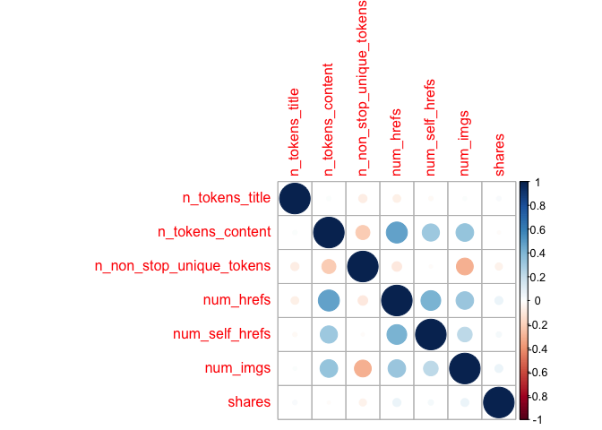

ST558Project2
================
Yuyao Liu
10/14/2020

# Introduction

I will analyze the Online News Popularity Data. This dataset summarizes
a heterogeneous set of features about articles published by Mashable in
a period of two years. There are 61 variables in the dataset which
contains 58 predictive attributes, 2 non-predictive attributes and one
target variable ‘share’. I choose some of the predictive variables that
can contains most of the information. For example, I choose some
variables of average values instead of minimum or maximum, so it may get
rid of some outliers. Also, some variables are about sentiment polarity
or subjectivity, I choose one variable of these two types that can
represent most information about word tokens. Meanwhile, I deleted some
variables that are highly correlated with some others.

## Predictors:

1.  n\_tokens\_title: Number of words in the title

2.  n\_tokens\_content: Number of words in the content

3.  n\_non\_stop\_unique\_tokens: Rate of unique non-stop words in the
    content

4.  num\_hrefs: Number of links

5.  num\_self\_hrefs: Number of links to other articles published by
    Mashable

6.  num\_imgs: Number of images

7.  num\_videos: Number of videos

8.  average\_token\_length: Average length of the words in the content

9.  num\_keywords: Number of keywords in the metadata

10. data\_channel\_is\_lifestyle: Is data channel ‘Lifestyle’?

11. data\_channel\_is\_entertainment: Is data channel ‘Entertainment’?

12. data\_channel\_is\_bus: Is data channel ‘Business’?

13. data\_channel\_is\_socmed: Is data channel ‘Social Media’?

14. data\_channel\_is\_tech: Is data channel ‘Tech’?

15. data\_channel\_is\_world: Is data channel ‘World’?

16. kw\_avg\_min: Worst keyword (avg. shares)

17. kw\_avg\_max: Best keyword (avg. shares)

18. kw\_avg\_avg: Avg. keyword (avg. shares)

19. self\_reference\_avg\_sharess: Avg. shares of referenced articles in
    Mashable

20. LDA\_00: Closeness to LDA topic 0

21. LDA\_01: Closeness to LDA topic 1

22. LDA\_02: Closeness to LDA topic 2

23. LDA\_03: Closeness to LDA topic 3

24. LDA\_04: Closeness to LDA topic 4

25. global\_rate\_positive\_words: Rate of positive words in the content

26. global\_rate\_negative\_words: Rate of negative words in the content

27. avg\_positive\_polarity: Avg. polarity of positive words

28. avg\_negative\_polarity: Avg. polarity of negative words

29. title\_subjectivity: Title subjectivity

30. title\_sentiment\_polarity: Title polarity

## Response/Target

shares: Number of shares

## Goal

The goal is to predict the number of shares(`shares`) in social
networks. I will use regression tree and boosted tree to predict shares,
and compare them using test set.

``` r
library(rmarkdown)
library(tidyverse)
library(caret)
library(corrplot)
```

# Data

``` r
temp_news <- read_csv(file = "./OnlineNewsPopularity.csv")
weekday <- vector()
for(i in seq_len(nrow(temp_news))){
  if (temp_news$weekday_is_monday[i] == 1){
    weekday[i]  <- "monday"
  }
  else if (temp_news$weekday_is_tuesday[i] == 1){
    weekday[i]  <- "tuesday"
  }
  else if (temp_news$weekday_is_wednesday[i] == 1){
    weekday[i]  <- "wednesday"
  }
  else if (temp_news$weekday_is_thursday[i] == 1){
    weekday[i]  <- "thursday"
  }
  else if (temp_news$weekday_is_friday[i] == 1){
    weekday[i]  <- "friday"
  }
  else if (temp_news$weekday_is_saturday[i] == 1){
    weekday[i]  <- "saturday"
  }
  else if(temp_news$weekday_is_sunday[i] == 1){
    weekday[i]  <- "sunday"
  }
}
np <- cbind(temp_news, weekday)
news <- np %>% filter(weekday == params$weekday) %>% select(n_tokens_title, n_tokens_content, n_non_stop_unique_tokens, num_hrefs, num_self_hrefs, num_imgs, num_videos, average_token_length, num_keywords, data_channel_is_lifestyle, data_channel_is_entertainment, data_channel_is_bus, data_channel_is_socmed,data_channel_is_tech,data_channel_is_world,kw_avg_min, kw_avg_max,kw_avg_avg,self_reference_avg_sharess,LDA_00,LDA_01,LDA_02, LDA_03, LDA_04, global_rate_positive_words,global_rate_negative_words,avg_positive_polarity,avg_negative_polarity,title_subjectivity,title_sentiment_polarity,shares)
news$data_channel_is_lifestyle <- as.factor(news$data_channel_is_lifestyle)
news$data_channel_is_entertainment <- as.factor(news$data_channel_is_entertainment)
news$data_channel_is_bus <- as.factor(news$data_channel_is_bus)
news$data_channel_is_socmed <- as.factor(news$data_channel_is_socmed)
news$data_channel_is_tech <- as.factor(news$data_channel_is_tech)
news$data_channel_is_world <- as.factor(news$data_channel_is_world)
set.seed(558)
train <- sample(1:nrow(news), size = nrow(news)*0.7) 
test <- dplyr::setdiff(1:nrow(news), train) 
newsTrain <- news[train, ]
newsTest <- news[test, ]
```

# Summarizations

## Summary

The summary of training data includes minimum, 1st quantile, median,
mean, 3rd quantile and maximum.

``` r
sum_news <- select(newsTrain, -contains("data_channel"))
summary(sum_news)
```

    ##  n_tokens_title  n_tokens_content n_non_stop_unique_tokens
    ##  Min.   : 3.00   Min.   :   0.0   Min.   :0.0000          
    ##  1st Qu.: 9.00   1st Qu.: 244.0   1st Qu.:0.6233          
    ##  Median :10.00   Median : 401.0   Median :0.6899          
    ##  Mean   :10.32   Mean   : 538.7   Mean   :0.6709          
    ##  3rd Qu.:12.00   3rd Qu.: 700.0   3rd Qu.:0.7525          
    ##  Max.   :17.00   Max.   :4585.0   Max.   :1.0000          
    ##    num_hrefs      num_self_hrefs      num_imgs         num_videos    
    ##  Min.   :  0.00   Min.   : 0.000   Min.   :  0.000   Min.   : 0.000  
    ##  1st Qu.:  4.00   1st Qu.: 1.000   1st Qu.:  1.000   1st Qu.: 0.000  
    ##  Median :  7.00   Median : 3.000   Median :  1.000   Median : 0.000  
    ##  Mean   : 10.61   Mean   : 3.174   Mean   :  4.531   Mean   : 1.185  
    ##  3rd Qu.: 13.00   3rd Qu.: 4.000   3rd Qu.:  4.000   3rd Qu.: 1.000  
    ##  Max.   :140.00   Max.   :56.000   Max.   :100.000   Max.   :74.000  
    ##  average_token_length  num_keywords      kw_avg_min        kw_avg_max    
    ##  Min.   :0.000        Min.   : 1.000   Min.   :   -1.0   Min.   :  3842  
    ##  1st Qu.:4.486        1st Qu.: 6.000   1st Qu.:  143.6   1st Qu.:173259  
    ##  Median :4.675        Median : 7.000   Median :  236.4   Median :247278  
    ##  Mean   :4.549        Mean   : 7.182   Mean   :  305.5   Mean   :261470  
    ##  3rd Qu.:4.863        3rd Qu.: 9.000   3rd Qu.:  353.6   3rd Qu.:335161  
    ##  Max.   :6.198        Max.   :10.000   Max.   :10420.8   Max.   :843300  
    ##    kw_avg_avg    self_reference_avg_sharess     LDA_00       
    ##  Min.   :  489   Min.   :     0.0           Min.   :0.01818  
    ##  1st Qu.: 2364   1st Qu.:   940.8           1st Qu.:0.02515  
    ##  Median : 2840   Median :  2200.0           Median :0.03387  
    ##  Mean   : 3110   Mean   :  6468.8           Mean   :0.20046  
    ##  3rd Qu.: 3569   3rd Qu.:  5199.8           3rd Qu.:0.29116  
    ##  Max.   :19429   Max.   :690400.0           Max.   :0.92000  
    ##      LDA_01            LDA_02            LDA_03            LDA_04       
    ##  Min.   :0.01818   Min.   :0.01818   Min.   :0.01818   Min.   :0.01818  
    ##  1st Qu.:0.02501   1st Qu.:0.02857   1st Qu.:0.02565   1st Qu.:0.02857  
    ##  Median :0.03335   Median :0.04001   Median :0.04000   Median :0.04081  
    ##  Mean   :0.13766   Mean   :0.21542   Mean   :0.21838   Mean   :0.22808  
    ##  3rd Qu.:0.14971   3rd Qu.:0.32870   3rd Qu.:0.36411   3rd Qu.:0.38852  
    ##  Max.   :0.91997   Max.   :0.92000   Max.   :0.91994   Max.   :0.92645  
    ##  global_rate_positive_words global_rate_negative_words
    ##  Min.   :0.00000            Min.   :0.000000          
    ##  1st Qu.:0.02891            1st Qu.:0.009524          
    ##  Median :0.03911            Median :0.015385          
    ##  Mean   :0.03960            Mean   :0.016638          
    ##  3rd Qu.:0.05028            3rd Qu.:0.021630          
    ##  Max.   :0.15278            Max.   :0.162037          
    ##  avg_positive_polarity avg_negative_polarity title_subjectivity
    ##  Min.   :0.0000        Min.   :-1.0000       Min.   :0.0000    
    ##  1st Qu.:0.3015        1st Qu.:-0.3252       1st Qu.:0.0000    
    ##  Median :0.3568        Median :-0.2514       Median :0.1667    
    ##  Mean   :0.3503        Mean   :-0.2582       Mean   :0.2836    
    ##  3rd Qu.:0.4109        3rd Qu.:-0.1855       3rd Qu.:0.5000    
    ##  Max.   :0.8500        Max.   : 0.0000       Max.   :1.0000    
    ##  title_sentiment_polarity     shares      
    ##  Min.   :-1.00000         Min.   :     8  
    ##  1st Qu.: 0.00000         1st Qu.:   889  
    ##  Median : 0.00000         Median :  1400  
    ##  Mean   : 0.06661         Mean   :  2972  
    ##  3rd Qu.: 0.13636         3rd Qu.:  2500  
    ##  Max.   : 1.00000         Max.   :133700

## Correlation

We can explore the data using correlation especially how these variables
as predictors are correlated with our target response `shares`.

Due to the large amount of variables, we may visualize them as groups.
The first nine variables are about numbers. Let’s see the correlation of
first nine variables and `shares`.

``` r
corr1 <- select(sum_news, 1:9, shares) %>% cor()
corrplot(corr1)
```

<!-- -->

Most of variables are not highly correlated with others.

Let’s see the variables about the content and word use and response
`shares`.

``` r
corr2 <- select(sum_news, 10:18, shares) %>% cor()
corrplot(corr2)
```

<!-- -->

``` r
corr3 <- select(sum_news, -c(1:18)) %>% cor()
corrplot(corr3)
```

<!-- -->

**All the predictors are little correlated to `shares`, even the
correlation .**

We may not get a very reasonable model to predict shares using these
predictors.

# Modeling

## Nonlinear model

### Regression tree

The first model I create is a tree-based model chosen using leave one
out cross validation. The response for this data is continuous, so I use
regression tree model.

**How do we fit the regression tree model?**

We fit the model using greedy algorithm. For every possible value of
each predictor, find residual sum of squares and minimize them.

I standardize the numeric predictors by centering and scaling.
Meanwhile, I determine tuning parameter choises using leave one out
cross validation.

The final chosen model is:

``` r
set.seed(558)
regTree <- train(shares ~ ., data = newsTrain, method = "rpart",
trControl = trainControl(method = "LOOCV"), preProcess = c("center", "scale"))
regTree
```

    ## CART 
    ## 
    ## 5086 samples
    ##   30 predictor
    ## 
    ## Pre-processing: centered (30), scaled (30) 
    ## Resampling: Leave-One-Out Cross-Validation 
    ## Summary of sample sizes: 5085, 5085, 5085, 5085, 5085, 5085, ... 
    ## Resampling results across tuning parameters:
    ## 
    ##   cp          RMSE      Rsquared     MAE     
    ##   0.01078663  6325.410  0.005973964  2801.241
    ##   0.01185481  6212.465  0.007852765  2703.945
    ##   0.03242676  6335.876  0.018320800  2993.995
    ## 
    ## RMSE was used to select the optimal model using the smallest value.
    ## The final value used for the model was cp = 0.01185481.

**The final chosen model with best tuning parameters**

``` r
regTree$bestTune %>% knitr::kable()
```

|   |        cp |
| - | --------: |
| 2 | 0.0118548 |

### Boosted tree - Ensemble

The second model I create is a boosted tree model chosen using
cross-validation.

**How do we fit the boosting model?**

The trees grown sequentially. Each subsequent tree is grown on a
modified version of original data. Predictions updated as trees grown.

Procedure:

1.  Initialize predictions as 0

2.  Find the residuals (observed-predicted), call the set of them *r*

3.  Fit a tree with *d* splits (*d*+1 terminal nodes) tresting the
    residuals as the response (which they are for the first fit)

4.  Update predictions

5.  Update residuals for new predictions and repeat *B* times

I also standardize the numeric predictors by centering and scaling and
determine tuning parameter choises using cross-validation.

The final chosen model is:

``` r
set.seed(558)
boostTree <- train(shares ~ ., data = newsTrain, method = "gbm",
trControl = trainControl(method = "cv", number = 10), preProcess = c("center", "scale"), verbose = FALSE)
boostTree
```

    ## Stochastic Gradient Boosting 
    ## 
    ## 5086 samples
    ##   30 predictor
    ## 
    ## Pre-processing: centered (30), scaled (30) 
    ## Resampling: Cross-Validated (10 fold) 
    ## Summary of sample sizes: 4579, 4577, 4579, 4576, 4576, 4577, ... 
    ## Resampling results across tuning parameters:
    ## 
    ##   interaction.depth  n.trees  RMSE      Rsquared    MAE     
    ##   1                   50      5798.979  0.04093980  2576.679
    ##   1                  100      5800.027  0.04643156  2575.131
    ##   1                  150      5807.675  0.04399556  2571.467
    ##   2                   50      5826.598  0.04116220  2572.400
    ##   2                  100      5873.603  0.03774160  2602.117
    ##   2                  150      5885.990  0.03976670  2610.794
    ##   3                   50      5860.277  0.03560426  2585.553
    ##   3                  100      5921.181  0.03145330  2609.088
    ##   3                  150      5978.023  0.02827297  2643.907
    ## 
    ## Tuning parameter 'shrinkage' was held constant at a value of 0.1
    ## 
    ## Tuning parameter 'n.minobsinnode' was held constant at a value of 10
    ## RMSE was used to select the optimal model using the smallest value.
    ## The final values used for the model were n.trees = 50,
    ##  interaction.depth = 1, shrinkage = 0.1 and n.minobsinnode = 10.

**The final chosen model with best tuning parameters**

``` r
boostTree$bestTune %>% knitr::kable()
```

| n.trees | interaction.depth | shrinkage | n.minobsinnode |
| ------: | ----------------: | --------: | -------------: |
|      50 |                 1 |       0.1 |             10 |

### Test and Compare

``` r
tree_pred <- postResample(predict(regTree, newdata = newsTest), newsTest$shares)
boost_pred <- postResample(predict(boostTree, newdata = newsTest), newsTest$shares)
round(rbind(tree_pred, boost_pred), 4)
```

    ##                RMSE Rsquared      MAE
    ## tree_pred  14400.07   0.0043 3240.818
    ## boost_pred 14382.88   0.0068 3198.356

Choose a better model with smaller root mean square error (RMSE),
smaller mean absolute error (MAE) and bigger R squared.
