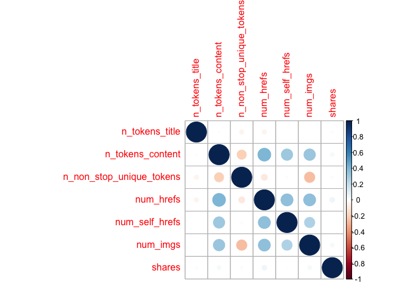
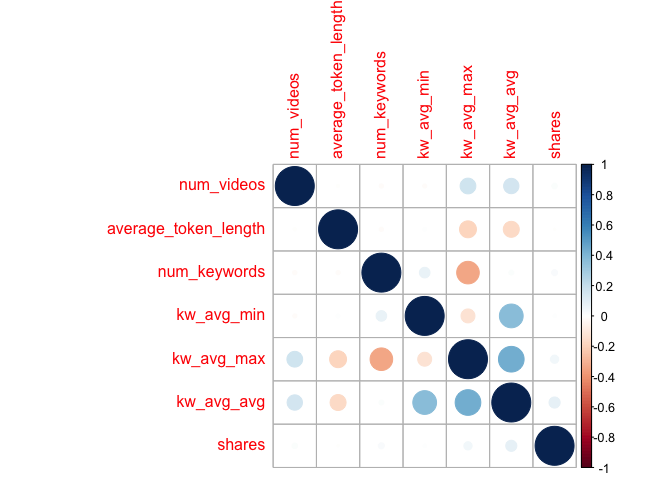

ST558Project2
================
Yuyao Liu
10/14/2020

# Introduction

I will analyze the Online News Popularity Data. This dataset summarizes
a heterogeneous set of features about articles published by Mashable in
a period of two years. There are 61 variables in the dataset which
contains 58 predictive attributes, 2 non-predictive attributes and one
target variable ‘share’. I choose some of the predictive variables that
can contains most of the information. For example, I choose some
variables of average values instead of minimum or maximum, so it may get
rid of some outliers. Also, some variables are about sentiment polarity
or subjectivity, I choose one variable of these two types that can
represent most information about word tokens. Meanwhile, I deleted some
variables that are highly correlated with some others.

## Predictors:

1.  n\_tokens\_title: Number of words in the title

2.  n\_tokens\_content: Number of words in the content

3.  n\_non\_stop\_unique\_tokens: Rate of unique non-stop words in the
    content

4.  num\_hrefs: Number of links

5.  num\_self\_hrefs: Number of links to other articles published by
    Mashable

6.  num\_imgs: Number of images

7.  num\_videos: Number of videos

8.  average\_token\_length: Average length of the words in the content

9.  num\_keywords: Number of keywords in the metadata

10. data\_channel\_is\_lifestyle: Is data channel ‘Lifestyle’?

11. data\_channel\_is\_entertainment: Is data channel ‘Entertainment’?

12. data\_channel\_is\_bus: Is data channel ‘Business’?

13. data\_channel\_is\_socmed: Is data channel ‘Social Media’?

14. data\_channel\_is\_tech: Is data channel ‘Tech’?

15. data\_channel\_is\_world: Is data channel ‘World’?

16. kw\_avg\_min: Worst keyword (avg. shares)

17. kw\_avg\_max: Best keyword (avg. shares)

18. kw\_avg\_avg: Avg. keyword (avg. shares)

19. self\_reference\_avg\_sharess: Avg. shares of referenced articles in
    Mashable

20. LDA\_00: Closeness to LDA topic 0

21. LDA\_01: Closeness to LDA topic 1

22. LDA\_02: Closeness to LDA topic 2

23. LDA\_03: Closeness to LDA topic 3

24. LDA\_04: Closeness to LDA topic 4

25. global\_rate\_positive\_words: Rate of positive words in the content

26. global\_rate\_negative\_words: Rate of negative words in the content

27. avg\_positive\_polarity: Avg. polarity of positive words

28. avg\_negative\_polarity: Avg. polarity of negative words

29. title\_subjectivity: Title subjectivity

30. title\_sentiment\_polarity: Title polarity

## Response/Target

shares: Number of shares

## Goal

The goal is to predict the number of shares(`shares`) in social
networks. I will use regression tree and boosted tree to predict shares,
and compare them using test set.

``` r
library(rmarkdown)
library(tidyverse)
library(caret)
library(corrplot)
library(GGally)
```

# Data

``` r
temp_news <- read_csv(file = "./OnlineNewsPopularity.csv")
weekday <- vector()
for(i in seq_len(nrow(temp_news))){
  if (temp_news$weekday_is_monday[i] == 1){
    weekday[i]  <- "monday"
  }
  else if (temp_news$weekday_is_tuesday[i] == 1){
    weekday[i]  <- "tuesday"
  }
  else if (temp_news$weekday_is_wednesday[i] == 1){
    weekday[i]  <- "wednesday"
  }
  else if (temp_news$weekday_is_thursday[i] == 1){
    weekday[i]  <- "thursday"
  }
  else if (temp_news$weekday_is_friday[i] == 1){
    weekday[i]  <- "friday"
  }
  else if (temp_news$weekday_is_saturday[i] == 1){
    weekday[i]  <- "saturday"
  }
  else if(temp_news$weekday_is_sunday[i] == 1){
    weekday[i]  <- "sunday"
  }
}
np <- cbind(temp_news, weekday)
news <- np %>% filter(weekday == params$weekday) %>% select(n_tokens_title, n_tokens_content, n_non_stop_unique_tokens, num_hrefs, num_self_hrefs, num_imgs, num_videos, average_token_length, num_keywords, data_channel_is_lifestyle, data_channel_is_entertainment, data_channel_is_bus, data_channel_is_socmed,data_channel_is_tech,data_channel_is_world,kw_avg_min, kw_avg_max,kw_avg_avg,self_reference_avg_sharess,LDA_00,LDA_01,LDA_02, LDA_03, LDA_04, global_rate_positive_words,global_rate_negative_words,avg_positive_polarity,avg_negative_polarity,title_subjectivity,title_sentiment_polarity,shares)
news$data_channel_is_lifestyle <- as.factor(news$data_channel_is_lifestyle)
news$data_channel_is_entertainment <- as.factor(news$data_channel_is_entertainment)
news$data_channel_is_bus <- as.factor(news$data_channel_is_bus)
news$data_channel_is_socmed <- as.factor(news$data_channel_is_socmed)
news$data_channel_is_tech <- as.factor(news$data_channel_is_tech)
news$data_channel_is_world <- as.factor(news$data_channel_is_world)
set.seed(558)
train <- sample(1:nrow(news), size = nrow(news)*0.7) 
test <- dplyr::setdiff(1:nrow(news), train) 
newsTrain <- news[train, ]
newsTest <- news[test, ]
```

# Summarizations

## Summary

The summary of training data includes minimum, 1st quantile, median,
mean, 3rd quantile and maximum values of each variable.

``` r
sum_news <- select(newsTrain, -contains("data_channel"))
summary(sum_news)
```

    ##  n_tokens_title  n_tokens_content n_non_stop_unique_tokens   num_hrefs    
    ##  Min.   : 4.00   Min.   :   0.0   Min.   :0.0000           Min.   :  0.0  
    ##  1st Qu.: 9.00   1st Qu.: 240.0   1st Qu.:0.6284           1st Qu.:  4.0  
    ##  Median :10.00   Median : 398.0   Median :0.6931           Median :  7.0  
    ##  Mean   :10.43   Mean   : 524.7   Mean   :0.6757           Mean   : 10.1  
    ##  3rd Qu.:12.00   3rd Qu.: 694.2   3rd Qu.:0.7583           3rd Qu.: 12.0  
    ##  Max.   :18.00   Max.   :4130.0   Max.   :1.0000           Max.   :150.0  
    ##  num_self_hrefs      num_imgs        num_videos     average_token_length
    ##  Min.   : 0.000   Min.   : 0.000   Min.   : 0.000   Min.   :0.000       
    ##  1st Qu.: 1.000   1st Qu.: 1.000   1st Qu.: 0.000   1st Qu.:4.475       
    ##  Median : 2.000   Median : 1.000   Median : 0.000   Median :4.667       
    ##  Mean   : 3.123   Mean   : 4.148   Mean   : 1.228   Mean   :4.543       
    ##  3rd Qu.: 4.000   3rd Qu.: 3.000   3rd Qu.: 1.000   3rd Qu.:4.854       
    ##  Max.   :33.000   Max.   :92.000   Max.   :58.000   Max.   :7.696       
    ##   num_keywords      kw_avg_min        kw_avg_max       kw_avg_avg     
    ##  Min.   : 1.000   Min.   :   -1.0   Min.   :  2240   Min.   :  424.3  
    ##  1st Qu.: 6.000   1st Qu.:  142.8   1st Qu.:173740   1st Qu.: 2372.1  
    ##  Median : 7.000   Median :  236.1   Median :246335   Median : 2841.7  
    ##  Mean   : 7.151   Mean   :  318.8   Mean   :262027   Mean   : 3118.9  
    ##  3rd Qu.: 9.000   3rd Qu.:  356.9   3rd Qu.:336787   3rd Qu.: 3560.8  
    ##  Max.   :10.000   Max.   :18687.8   Max.   :843300   Max.   :21000.7  
    ##  self_reference_avg_sharess     LDA_00            LDA_01            LDA_02       
    ##  Min.   :     0             Min.   :0.01827   Min.   :0.01820   Min.   :0.01819  
    ##  1st Qu.:   964             1st Qu.:0.02521   1st Qu.:0.02504   1st Qu.:0.02857  
    ##  Median :  2200             Median :0.03354   Median :0.03335   Median :0.04001  
    ##  Mean   :  6331             Mean   :0.19216   Mean   :0.13655   Mean   :0.21632  
    ##  3rd Qu.:  5026             3rd Qu.:0.26605   3rd Qu.:0.15007   3rd Qu.:0.32945  
    ##  Max.   :446567             Max.   :0.92000   Max.   :0.91998   Max.   :0.92000  
    ##      LDA_03            LDA_04        global_rate_positive_words
    ##  Min.   :0.01820   Min.   :0.01818   Min.   :0.00000           
    ##  1st Qu.:0.02857   1st Qu.:0.02858   1st Qu.:0.02804           
    ##  Median :0.04000   Median :0.05000   Median :0.03870           
    ##  Mean   :0.21985   Mean   :0.23512   Mean   :0.03929           
    ##  3rd Qu.:0.36532   3rd Qu.:0.39588   3rd Qu.:0.04979           
    ##  Max.   :0.91998   Max.   :0.92000   Max.   :0.15549           
    ##  global_rate_negative_words avg_positive_polarity avg_negative_polarity
    ##  Min.   :0.000000           Min.   :0.0000        Min.   :-1.0000      
    ##  1st Qu.:0.009375           1st Qu.:0.3049        1st Qu.:-0.3275      
    ##  Median :0.014960           Median :0.3576        Median :-0.2500      
    ##  Mean   :0.016241           Mean   :0.3516        Mean   :-0.2573      
    ##  3rd Qu.:0.021616           3rd Qu.:0.4076        3rd Qu.:-0.1833      
    ##  Max.   :0.083440           Max.   :1.0000        Max.   : 0.0000      
    ##  title_subjectivity title_sentiment_polarity     shares      
    ##  Min.   :0.0000     Min.   :-1.00000         Min.   :    48  
    ##  1st Qu.:0.0000     1st Qu.: 0.00000         1st Qu.:   890  
    ##  Median :0.1000     Median : 0.00000         Median :  1300  
    ##  Mean   :0.2753     Mean   : 0.06445         Mean   :  3429  
    ##  3rd Qu.:0.5000     3rd Qu.: 0.13636         3rd Qu.:  2600  
    ##  Max.   :1.0000     Max.   : 1.00000         Max.   :843300

## Correlation

We can explore the data using correlation especially how these variables
as predictors are correlated with our target response `shares`.

Due to the large amount of variables, we can visualize them as groups. I
divide 30 predictors into 4 groups. Each group has 6 predictors and one
response `share`.

*group1*

``` r
subnews1 <- select(sum_news, 1:6, shares)
corr1 <- cor(subnews1)
corrplot(corr1)
```

<!-- -->

*group 2*

``` r
subnews2 <- select(sum_news, 7:12, shares)
corr2 <- cor(subnews2)
corrplot(corr2)
```

<!-- -->

*group3*

``` r
subnews3 <- select(sum_news, 13:18, shares)
corr3 <- cor(subnews3)
corrplot(corr3)
```

<!-- -->

*group4*

``` r
subnews4 <- select(sum_news, -c(1:18))
corr4 <- cor(subnews4)
corrplot(corr4)
```

<!-- -->

The light color and smaller size of circle mean that the absolute
correlation value is small. Thus, the graphs above show that most of
predictors are not highly correlated with others. Meanwhile, **all the
predictors are little correlated to `shares`, even the correlations
between predictors and response are almost equal to 0.**

## Plots of relationships between predictors and response

*group1*

``` r
ggpairs(subnews1)
```

<!-- -->

*group2*

``` r
ggpairs(subnews2)
```

<!-- -->

*group3*

``` r
ggpairs(subnews3)
```

<!-- -->

*group4*

``` r
ggpairs(subnews4)
```

<!-- -->

The pairs of plots show the relationships between each two variables.
The last row of plots show the relationship between predictors and
`shares`.

**As the pairs plots shown, `shares` is less related to the
predictors.**

# Modeling

## Nonlinear model

### Regression tree

The first model I create is a tree-based model chosen using leave one
out cross validation. The response for this data is continuous, so I use
regression tree model.

**How do we fit the regression tree model?**

We fit the model using greedy algorithm. For every possible value of
each predictor, find residual sum of squares and minimize them.

I standardize the numeric predictors by centering and scaling.
Meanwhile, I determine tuning parameter choises using leave one out
cross validation.

The final chosen model is:

``` r
set.seed(558)
regTree <- train(shares ~ ., data = newsTrain, method = "rpart",
trControl = trainControl(method = "LOOCV"), preProcess = c("center", "scale"))
regTree
```

    ## CART 
    ## 
    ## 5204 samples
    ##   30 predictor
    ## 
    ## Pre-processing: centered (30), scaled (30) 
    ## Resampling: Leave-One-Out Cross-Validation 
    ## Summary of sample sizes: 5203, 5203, 5203, 5203, 5203, 5203, ... 
    ## Resampling results across tuning parameters:
    ## 
    ##   cp           RMSE      Rsquared      MAE     
    ##   0.003157699  17965.09  1.646664e-04  3602.454
    ##   0.003229876  17944.75  2.442826e-04  3556.883
    ##   0.031496352  17663.04  1.711433e-07  4104.040
    ## 
    ## RMSE was used to select the optimal model using the smallest value.
    ## The final value used for the model was cp = 0.03149635.

**The final chosen model with best tuning parameters**

``` r
regTree$bestTune %>% knitr::kable()
```

|   |        cp |
| - | --------: |
| 3 | 0.0314964 |

### Boosted tree - Ensemble

The second model I create is a boosted tree model chosen using
cross-validation.

**How do we fit the boosting model?**

The trees grown sequentially. Each subsequent tree is grown on a
modified version of original data. Predictions updated as trees grown.

Procedure:

1.  Initialize predictions as 0

2.  Find the residuals (observed-predicted), call the set of them *r*

3.  Fit a tree with *d* splits (*d*+1 terminal nodes) tresting the
    residuals as the response (which they are for the first fit)

4.  Update predictions

5.  Update residuals for new predictions and repeat *B* times

I also standardize the numeric predictors by centering and scaling and
determine tuning parameter choises using cross-validation.

The final chosen model is:

``` r
set.seed(558)
boostTree <- train(shares ~ ., data = newsTrain, method = "gbm",
trControl = trainControl(method = "cv", number = 10), preProcess = c("center", "scale"), verbose = FALSE)
boostTree
```

    ## Stochastic Gradient Boosting 
    ## 
    ## 5204 samples
    ##   30 predictor
    ## 
    ## Pre-processing: centered (30), scaled (30) 
    ## Resampling: Cross-Validated (10 fold) 
    ## Summary of sample sizes: 4684, 4684, 4685, 4682, 4682, 4686, ... 
    ## Resampling results across tuning parameters:
    ## 
    ##   interaction.depth  n.trees  RMSE      Rsquared     MAE     
    ##   1                   50      12813.48  0.022314265  3356.657
    ##   1                  100      12890.97  0.021560078  3372.957
    ##   1                  150      12875.95  0.025292208  3380.083
    ##   2                   50      13069.88  0.015820668  3441.120
    ##   2                  100      13169.26  0.016543784  3492.770
    ##   2                  150      13395.27  0.014742521  3573.932
    ##   3                   50      13512.17  0.008460315  3573.703
    ##   3                  100      13680.22  0.010078481  3703.879
    ##   3                  150      13885.97  0.008896755  3832.393
    ## 
    ## Tuning parameter 'shrinkage' was held constant at a value of 0.1
    ## Tuning
    ##  parameter 'n.minobsinnode' was held constant at a value of 10
    ## RMSE was used to select the optimal model using the smallest value.
    ## The final values used for the model were n.trees = 50, interaction.depth =
    ##  1, shrinkage = 0.1 and n.minobsinnode = 10.

**The final chosen model with best tuning parameters**

``` r
boostTree$bestTune %>% knitr::kable()
```

| n.trees | interaction.depth | shrinkage | n.minobsinnode |
| ------: | ----------------: | --------: | -------------: |
|      50 |                 1 |       0.1 |             10 |

### Test and Compare

``` r
tree_pred <- postResample(predict(regTree, newdata = newsTest), newsTest$shares)
boost_pred <- postResample(predict(boostTree, newdata = newsTest), newsTest$shares)
round(rbind(tree_pred, boost_pred), 4)
```

    ##                RMSE Rsquared      MAE
    ## tree_pred  7073.557       NA 3038.289
    ## boost_pred 7107.753   0.0444 3035.050

Smaller root mean square error (RMSE) and smaller mean absolute error
(MAE) shows that we have a better fit of data and more accurate
predictions in test dataset.

Choose the better model with relatively smaller root mean square error
(RMSE), smaller mean absolute error (MAE) and bigger R squared.
